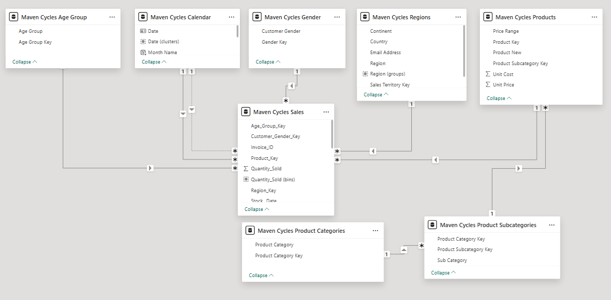
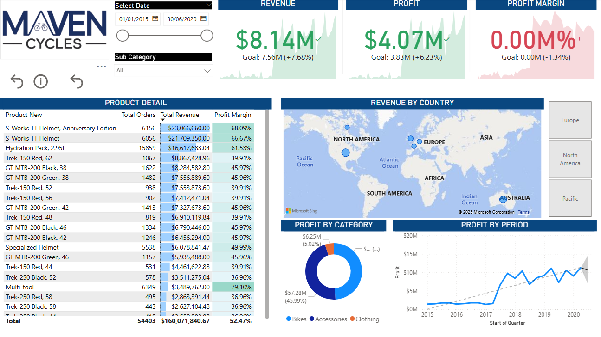
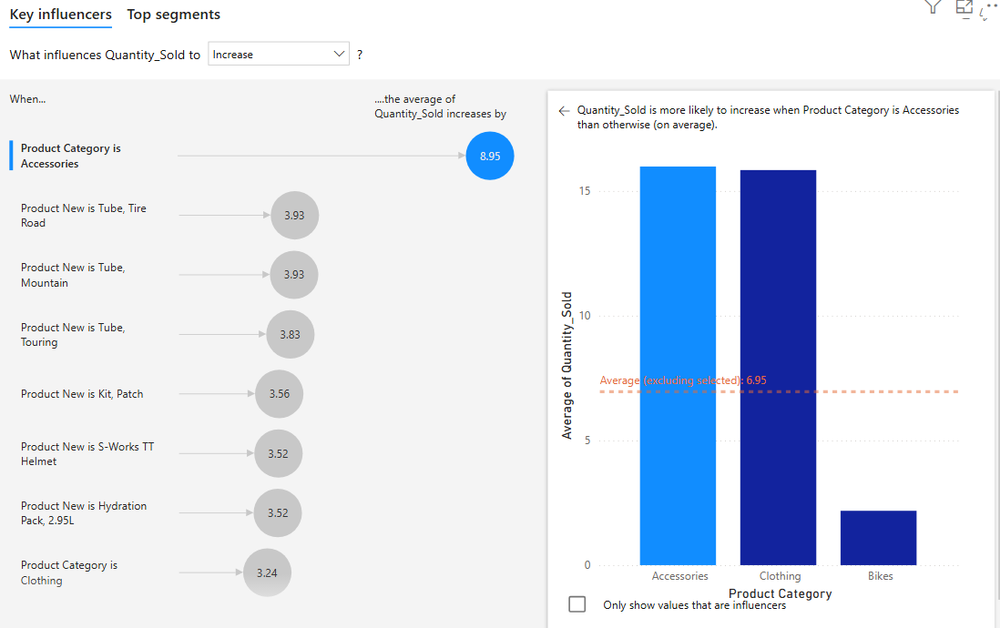
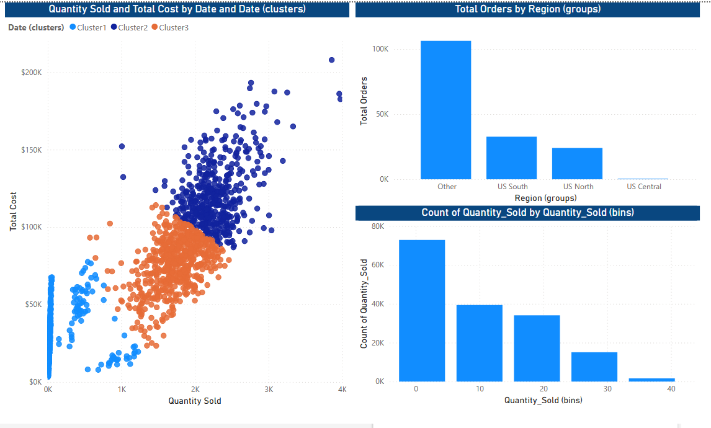

# Retail Sales Performance Dashboard for Maven Cycles

A real-world business intelligence case study simulating the role of a Business Intelligence Analyst at Maven Cycles, a boutique bicycle retailer.

---

## Project Overview

**Situation**  
You've been brought on as the lead Business Intelligence Analyst at Maven Cycles to build a full BI solution.

**Brief**  
You're tasked with building an end-to-end reporting solution using raw data on sales, products, customer demographics, and store locations.

**Objectives**
- Prepare and clean raw data
- Build and optimize a data model
- Create powerful visualizations
- Analyze trends and business performance
- Deploy reports using Microsoft Power BI

---

## 🛠 Tools & Skills Used

- Power BI Desktop
- Power Query (M language)
- DAX (Data Analysis Expressions)
- Data Modeling (Star Schema)
- Data Visualization

---

## Data Model

The data model was built from **8 separate raw Excel files**, each representing a distinct dimension or fact table. These were integrated in Power BI using a **star schema**, centered around the `Sales` fact table.

### Source Files
- `Sales.xlsx`
- `Products.xlsx`
- `Product_Categories.xlsx`
- `Product_Subcategories.xlsx`
- `Customers_Age_Group.xlsx`
- `Customers_Gender.xlsx`
- `Regions.xlsx`
- `Calendar.xlsx`

### Model Design
- The `Sales` table serves as the core fact table.
- Dimension tables (Products, Customers, Calendar, Regions) are linked via one-to-many relationships.
- Columns were cleaned and standardized using Power Query.

---

## Dashboard Insights

The interactive dashboard includes:

- Top-selling products & categories
- Sales performance across regions and time
- Customer segmentation by age and gender
- Revenue and profit analysis
- Inventory insights for better planning

---

## 🔍 Key Influencer Analysis

Using Power BI's Key Influencers visual, I analyzed what drives higher sales volume (`Quantity_Sold`).

### Insight:
- The **Product Category** "Accessories" was the strongest positive influencer, increasing average quantity sold by 8.95 units.

---

## Clustering Analysis

To uncover patterns in customer behavior and sales, I used Power BI’s Smart Clustering on `Quantity_Sold` and `Total Cost`.

### Insight:
- 3 clusters emerged showing distinct sales patterns.
- One cluster represents high-volume, high-cost orders — ideal for targeted promotions.

---

## Recommendations & Business Insights

Based on the analysis from this Power BI project, here are several strategic insights Maven Cycles could act on:

- **Focus on Accessories**: Accessories not only have the highest average quantity sold but also strongly influence sales growth. Prioritize inventory, bundling, and promotions in this category.

- **Target High-Volume Segments**: Clustering analysis identified a high-value customer segment placing large orders. Personalized marketing or loyalty programs could retain and grow this group.

- **Optimize Regional Strategy**: The majority of orders come from the “Other” region group. Investigate what areas this includes and consider regional promotions or expansion based on this demand.

- **Improve Inventory for High-Selling Products**: Products like bike tubes and kits consistently appear in top-selling categories. Ensure stock levels align with demand to avoid lost sales.

- **Leverage Gender & Age Data**: Use demographic segmentation to tailor marketing. For example, if younger customers favor specific products, align campaigns accordingly.

- **Monitor Quantity_Sold Trends Over Time**: Use time-based clustering to detect seasonal patterns and adjust stock or promotions accordingly.

---

